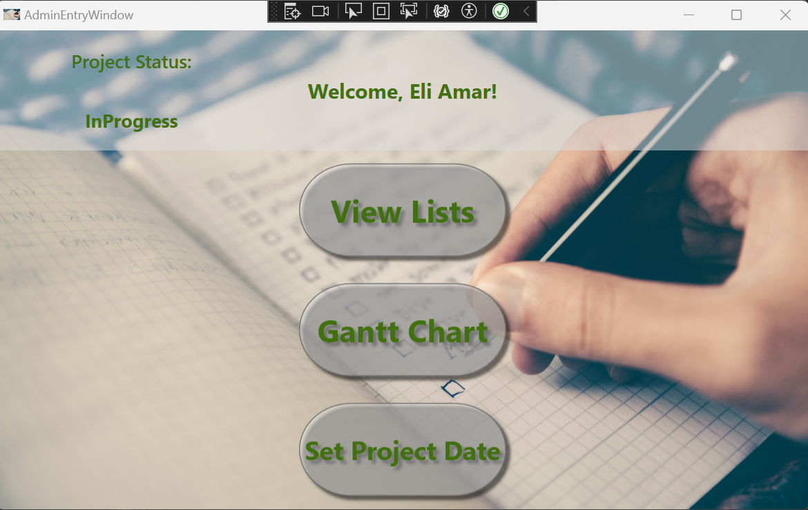

# Project Management Application

A C# .NET application for single project management with a graphical UI (implemented with WPF) for managers and engineers.

## Table of Contents
- [Features](#features)
- [Architecture](#architecture)
- [Technologies Used](#technologies-used)
- [Setup Instructions](#setup-instructions)
- [Usage Instructions](#usage-instructions)
- [Screenshots](#screenshots)

## Features
- Task scheduling
- Assigning engineers to tasks
- List views for engineers and tasks
- Gantt chart for project progress visualization
- Data storage using XML files
- LINQ queries for data retrieval

## Architecture
The project follows a 3-tier architecture:

### Data Layer (DL)
- **Storage:** XML files
- **Queries:** LINQ

### Business Layer (BL)
- **Language:** C#
- **Design Patterns:** Singleton, Factory, Dependency Injection

### Presentation Layer (PL)
- **Framework:** WPF
- **Patterns:** Observer, Data Binding

## Technologies Used
- C#
- .NET Framework
- WPF (Windows Presentation Foundation)
- LINQ (Language Integrated Query)
- XML for data storage

## Setup Instructions
1. **Clone the repository:**
    ```bash
    git clone https://github.com/pplevins/dotNet5784_1558_3645.git
    ```
2. **Navigate to the project directory:**
    ```bash
    cd dotNet5784_1558_3645
    ```
3. **Open the solution file in Visual Studio:**
    ```bash
    start dotNet5784_1558_3645.sln
    ```

## Usage Instructions
1. **Build the project in Visual Studio.**
2. **Run the application.**
3. **Use the graphical UI to manage tasks and engineers:**
    - Schedule tasks
    - Assign engineers to tasks
    - View lists of engineers and tasks
    - Monitor progress with the Gantt chart

## Screenshots

